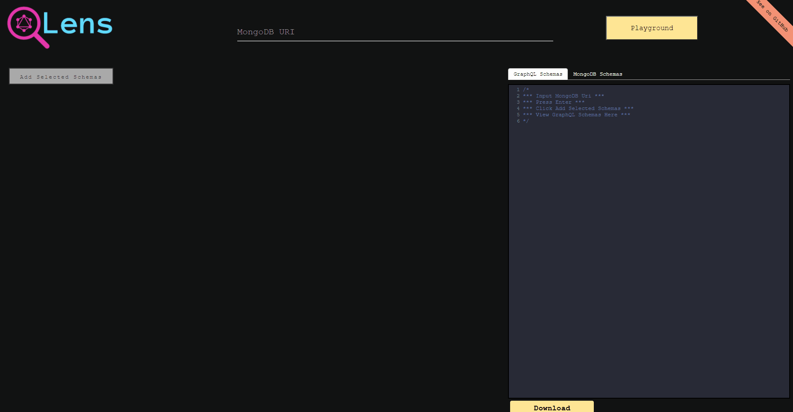
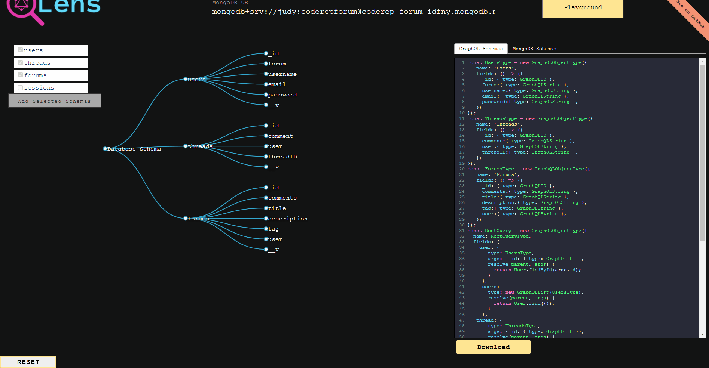

#

# QLens 

Using GraphQL with MongoDB can cause data mismatch and schema duplication requiring developers to write similar code multiple times. This can significantly slow down development time. In addition, there aren't many libraries that tackle MongoDB conversion to GraphQL schemas. Most libraries tackling this issue are focused on relational databases. QLens solves that problem. 

QLens — Open source tool to extract metadata from your MongoDB database to generate GraphQL schemas, resolvers and server setup.

Accelerated by [OS Labs](https://github.com/oslabs-beta/)

## Getting Started
Download QLens onto your desktop by going to  [www.qlensapp.com](http://qlensapp.com)

## Features
* GraphQL schema (including resolvers, and mutations) 
* Visual interactive diagram of Hierarchy Display
* Download Schemas
* GraphQL's Playground GUI

## How does QLens work? 

## 1. Enter URI
Simply enter your non-relational database (MongoDB) URI in the input form at the top of the screen and press enter. You will see a dropdown menu on the left hand side of the screen revealing all of your database schemas. Click the schemas you would like converted to GraphQL and then click the ‘Add Selected Schemas’ button. 

Please see below gif to reset the URI:

## 2. Select GraphQL Schemas
On the right side of the screen is where your life just got a whole lot easier. You will find your GraphQL schema boilerplate already entirely formatted for your project complete with resolvers and mutations. At the top of the text editor, you will see a tab to toggle to see your MongoDB schemas in their own editor. Here is where you can either copy your GraphQL schemas and paste right into your code editor, or click the download button.   

## 3. Download Schemas
Click the Download Schemas button at the bottom of the code editor and the GraphQL schema code will download into a folder on your desktop. Drag the folder into your preferred code editor and voilà! Formatted GraphQL schemas right there in your code editor! It’s that easy!   

## How To Contribute
We would love for you to test our application and submit any issues you encouter. Please feel free to fork your own repository to and submit your own pull requests.

## Built With

- Electron
- React
- Codemirror
- Jest
- Node.js
- Express
- Graphiql
- Graphql
- lodash
- Babel
- Webpack
- Enzyme
- React-Testing-Library
- Spectron

How you can contribute: 
* Bug fixes
* Implementing features
* Submitting or resolving GitHub issues
* Help market our application
## Developers
* [Steven LaBrie](https://github.com/stevenlabrie)
* [Judy Tan](https://github.com/Judanator)
* [Cho Yee Win Aung](https://github.com/choyeewinag)
* [Jake Diorio](https://github.com/jdiorio2393)

## License
This project is licensed under the MIT License

## Upcoming Features 
Currently QLens does not support playground functionality and has limited functionality for creating resolvers. Currently we are working on implementing the following features: 
* Playground functionality for testing queries and mutations 
* Generating mutations for updating 
* Generating resolvers for Mongo documents with "ref" or foreign keys 
* Allowing for conversion of SQL databases
